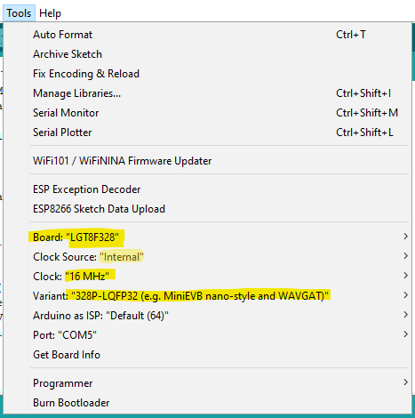

# Reprogramming the MIX5R for Virtual MIDI - macOS

This guide will help you convert the MIX5R Deej controller into a MIDI controller through the use of the "Hairless MIDI<->Serial Bridge."

## Part 1: Compiling Arduino Code

1. Download and install the Arduino IDE from here: <https://www.arduino.cc/en/software>
2. If needed get the driver for the mixer here: <http://wch-ic.com/downloads/CH341SER_MAC_ZIP.html>
3. Get the Arduino sketch (code) file from my GitHub. This is just a text file with a .ino file extension. <https://github.com/numanair/nano-control-surface/blob/main/hairless_control_surface_lgtx8p/hairless_control_surface_lgtx8p.ino>
4. Open the hairless_control_surface_lgtx8p.ino in the Arduino IDE. If it is not in its own folder the IDE will move it to one automatically (it might ask if you want to).
5. Follow the instructions in "How to install" to add the board to the IDE: <https://github.com/dbuezas/lgt8fx#how-to-install>
6. Set all the settings in the IDE *Tools* menu to match the below images. Now is also a good time to select the correct COM port for the board (must be plugged in).   

7. Open *Tools>Manage Libraries* and search for MultiMap. Click install.
8. Time to compile! Click the checkmark icon in the top left ("Verify" button) or click *Sketch>Verify/Compile*.
9. If there are no errors, click the Upload arrow button or *Sketch>Upload*.

## Part 2: Hairless MIDI setup

1. Download Hairless Serial MIDI. This program converts the serial data from the mixer into real MIDI messages. 
<https://projectgus.github.io/hairless-midiserial/>  
Newer macOS might need to use one of thse alternate versions:  
<https://github.com/projectgus/hairless-midiserial/issues/51#issuecomment-613583025>  
<https://github.com/juliogriebeler/hairless-midiserial/tree/master/macos_64>
2. Note that a serial (COM) port can only have one connection at a time.
3. Create a virtual MIDI port within macOS. Ableton has instructions here that are independent from their software: <https://help.ableton.com/hc/en-us/articles/209774225-Setting-up-a-virtual-MIDI-bus#Mac>
4. Connect Hairless MIDI Serial to the virtual MIDI port. You should see the green indicators in the Hairless program light up when moving a fader on the mixer.

## Part 3: Reverting to stock Deej code

This is the code I flash the mixer with when shipping the default configuration. Just putting this here in case you want to return to stock for use with Deej.<https://github.com/numanair/deej/blob/master/arduino/deej-5-sliders-LGTX8P/deej-5-sliders-LGTX8P.ino>
